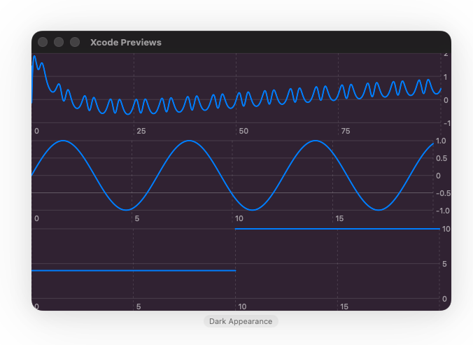

<p align="center">
  
</p>

<h1 align="center">CalculoKit</h1>

<p align="center">
  A lightweight Swift framework for symbolic calculus — starting with derivatives!
</p>

---

### 🚀 Features

- ✅ Symbolic **derivation** of mathematical expressions  
  > From `sin(x) + x^2` ➡️ to `cos(x) + 2x`
- 🧠 **Evaluation** of expressions at specific points
- 📈 **SwiftUI chart support** with smooth curve animations

---

### ✨ Example Usage

```swift
import CalculoKit

let x = variable("x")
let expression: MathExpr = MathExpr {
    sin(x) + pow(x, 2)
}

let derivative = expression.derivate
print(derivative) // Output: cos(x) + 2x
```

---

### 🖼 SwiftUI Animation Example

```swift
import CalculoKitSwiftUI

CalculoChart(
    expression: expression,
    withRespectTo: .x,
    xRange: -5...5
)
.frame(height: 300)
```
<p>
  
</p>

> 📈 Animated drawing of the curve from left to right using `Charts` and `SwiftUI`.

---

### 🧱 Goals

> CalculoKit is just getting started. In the future, we aim to support:

- MathExpr evaluation
- LaTeX export
- Integration
- Limits
- Simplification
- Factorization

---

### 📦 Installation

CalculoKit supports **Swift Package Manager**.

Add the following to your `Package.swift`:

```swift
.package(url: "https://github.com/carVaba/CalculoKit.git", from: "1.0.0")
```

And add `"CalculoKit"` and optionally `"CalculoKitSwiftUI"` to your dependencies:

```swift
.target(
    name: "YourApp",
    dependencies: [
        "CalculoKit",
        "CalculoKitSwiftUI"
    ]
)
```

---

### 🤝 Contributing

This project is built for fun and learning. Contributions and ideas are welcome!

---

### © License

MIT License
