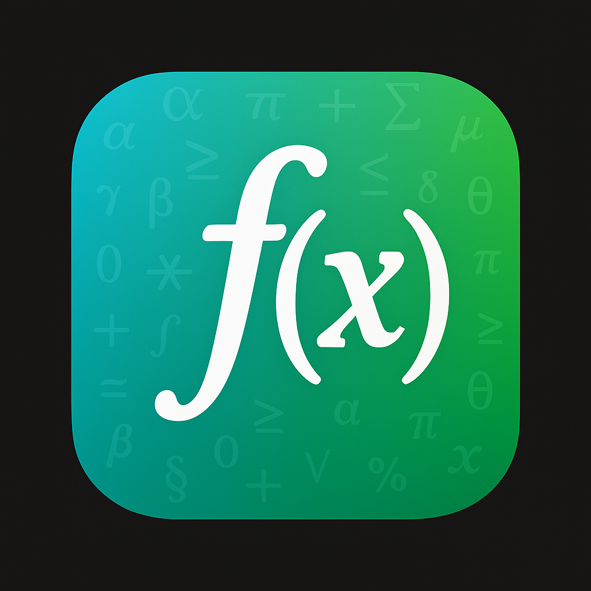

<p align="center">
  
</p>

<h1 align="center">CalculoKit</h1>

<p align="center">
  A lightweight Swift framework for symbolic calculus — starting with derivatives!
</p>

---

### 🚀 Features

- ✅ Symbolic **derivation** of mathematical expressions
  > From `sin(x) + x^2` ➡️ to `cos(x) + 2x`

---

### ✨ Example Usage

```swift
import CalculoKit

let x = variable("x")
let expression: Expression = Expression {
    sin(x) + pow(x, 2)
}

let derivative = expression.derivate
print(derivative) // Output: cos(x) + 2x
```

---

### 🧱 Goals

> CalculoKit is just getting started. In the future, we aim to support:

- Expression evaluation
- LaTeX export

---

### 📦 Installation

Swift Package Manager support coming soon...

---

### 🤝 Contributing

This project is built for fun and learning. Contributions and ideas are welcome!

---

### © License

MIT License
